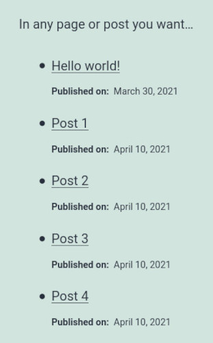

# Post Types Query Block

 

Post Types Query Block is a WordPress plugin which add a new Gutenberg block. It allows you to query post types and offers different options to customize the display.

## Introduction

By default, WordPress Gutenberg offers a Latest Posts block to display the recent posts but it does not include the custom post types or even the pages. So, I decide to create my own block with some settings to make it more reusable.

With Post Types Query Block, you can choose:

-   one post type to display among "_Posts_", "_Pages_", "_Media_" and your custom post types.
-   the number of posts to display.
-   the order ("_Title_", "_Publication date_", "_Update date_", "_Author_").
-   to filter by author, categories and tags.
-   the information you want to display (dates, author, featured image, excerpt) with or without label and you can even rewrite the labels.
-   the layout (list or grid) and some customization (no bullet lists or the number of grid columns).

## Install

### Composer install

You can use Composer to install this plugin as a dependency if you use custom installers:

```
{
"require": {
    "armandphilippot/post-types-query-block": "dev-master"
}
"repositories": [{
    "type": "git",
    "url": "git@github.com:ArmandPhilippot/post-types-query-block.git"
}]
```

### Manual install

You can download this plugin on Github/Gitlab, then extract it in `/wp-content/plugins/` directory.

## Usage

1. Navigate to the "_Plugins_" dashboard page and click on "_Activate_".
2. Choose "_**Post Types Query Block**_" inside Gutenberg Editor to add a new block.
3. Configure the settings in the sidebar and choose the layout with the toolbar buttons.

## Screenshots

These screenshots were taken with the "_Twenty Twenty-One_" theme of WordPress. I just made an adjustment to the meta since I use description list to display them and this theme use a `padding-left` with `dd`.

| List Preview                                                          | Grid Preview                                                          |
| --------------------------------------------------------------------- | --------------------------------------------------------------------- |
|    |    |
|  |  |

## Translation

Currently, the block is available in English and in French.

If you want to provide another translation for the plugin, any pull request is welcome. Likewise, if some words are misused in English, I accept the corrections. It's not my native language.

You can use `wp-cli` to generate a new POT file (`wp i18n make-pot`) then to convert it in JSON (`wp i18n make-json`). However, it is not working for me. It does not allow me to extract JS strings with `make-pot` and the `make-json` command output multiple files... it is not convenient.

So, you can process like me with [Poedit](https://poedit.net/) and [po2json](https://github.com/mikeedwards/po2json) (the last one is already present in `package.json`).

1. Copy `languages/PTQBlock.pot` and rename it to `languages/PTQBlock-{your-locale}.po`.
2. Use the tool you want to provide translations inside the `.po` file.
3. Convert the `.po` file to `.json` with `po2json` by using the `jed` format.

Example:

```bash
./node_modules/.bin/po2json languages/PTQBlock-fr_FR.po languages/PTQBlock-fr_FR-ptqblock-i18n.json -f jed
```

## License

This project is open source and available under the [GPL v2 or later License](https://github.com/ArmandPhilippot/post-types-query-block/blob/master/LICENSE).
